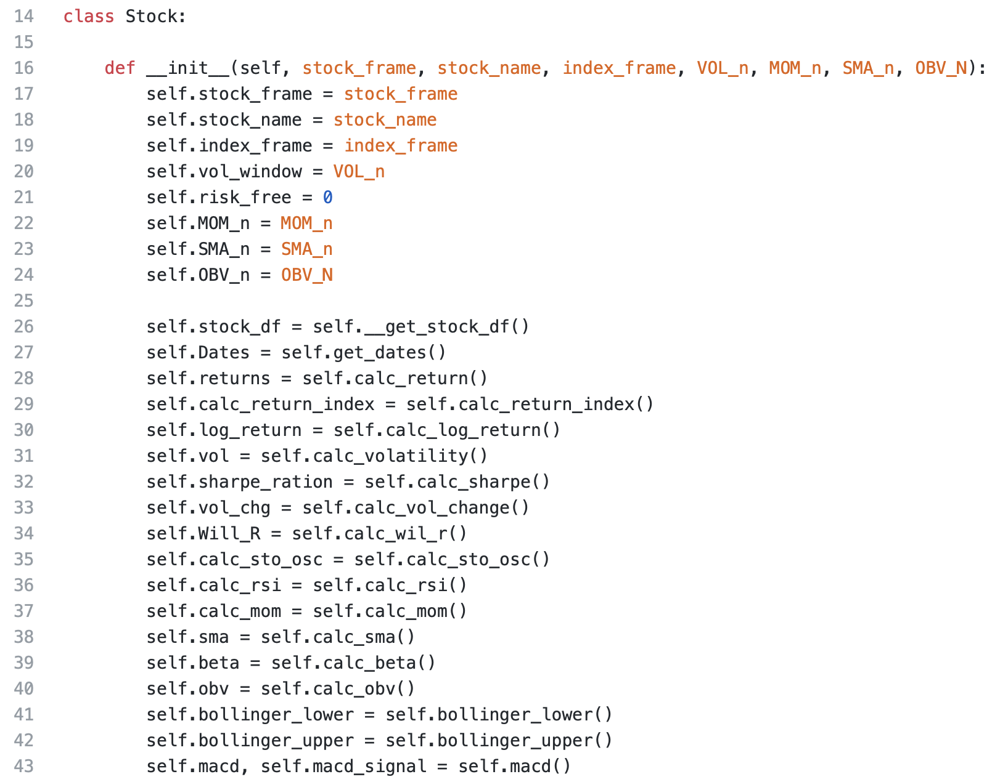
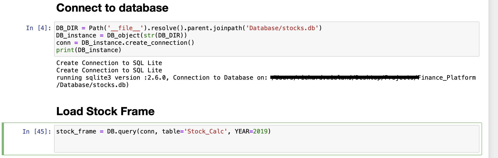

# Finance_Platform
--- under construction ---

## Initialize

- run with init to set up a sqlite with basic data model

## Calculate Key figures

- run with --calculate flag will will calculate the following key figures for each stock in the index:

## Loading Data from DB

## Dynamic Historical-Portfolios construction
To construct historical portfolios with highest return for training a model use the "Portfolio_Best_Return" function.
The function takes a Return_Matrix as an input to construct the best preforming protfolio per a given timeframe(at the moment: Month) for a number of stocks.
The "create_label" function will then create corresponding labels

## Dynamic Ploting

Use dynamic_ploting function to plot various key figures 

